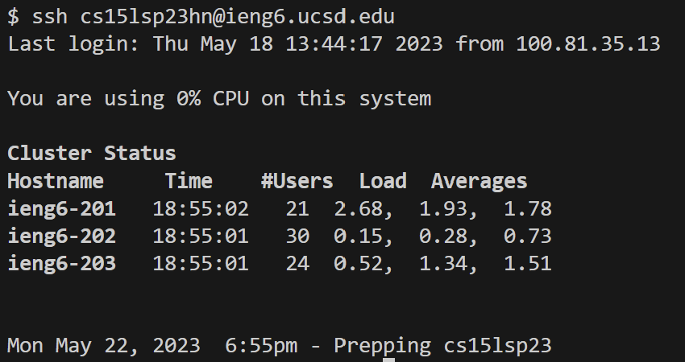
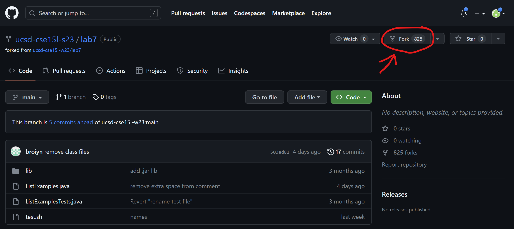
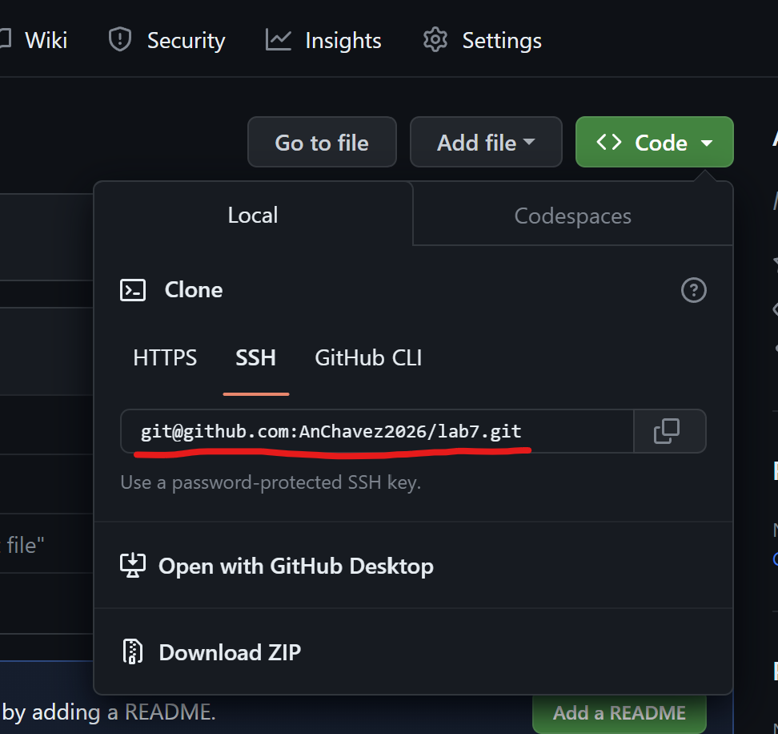
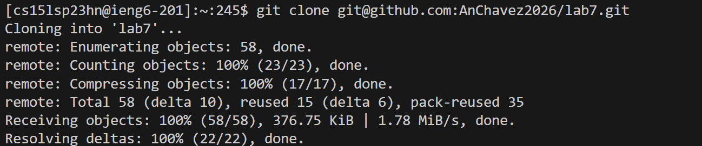
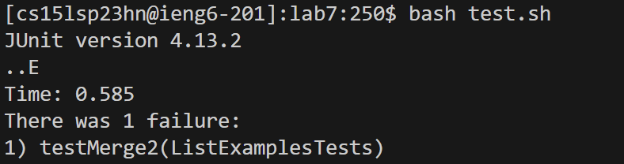
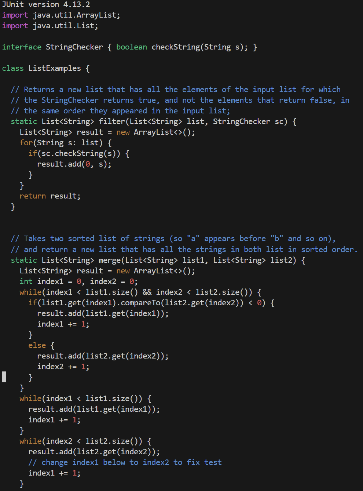
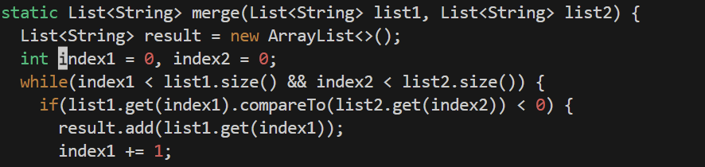
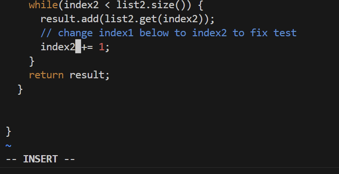
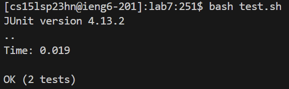
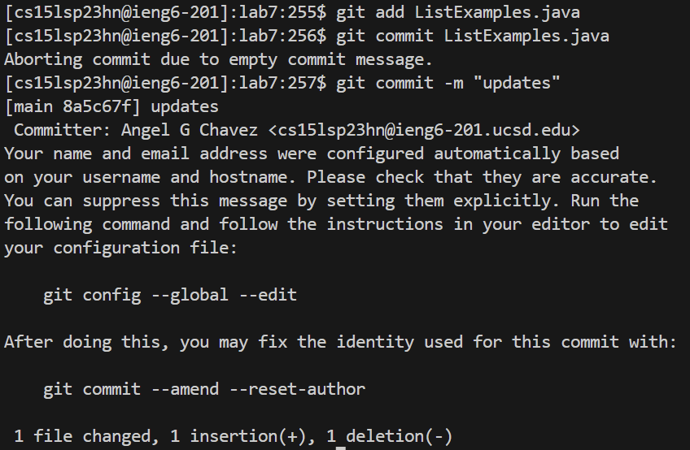

Lab Report 4
==========

This Lab will be going over the following steps from the previous lecture:
1. Log into ieng6
2. Clone your fork of the repository from your Github account
3. Run the tests, demonstrating that they fail
4. Edit the code file to fix the failing test
5. Run the tests, demonstrating that they now succeed
6. Commit and push the resulting change to your Github account (pick any commit message!)

STEP 1: Log into ieng6
----
> While on VSC I opened up a new terminal by pressing crtl + shift + \`
> Inside the terminal `ssh <space> cs15lsp23hn@ieng6.ucsd.edu <enter>` I didn't have to type in my password because i has previuosly linked my computer to my ieng6 account with a ssh key
> 
> 
> 
> And now I have successfully logged in to ieng6!

STEP 2: Clone repository from GitHub account
---
> Before I cloned my repository I first forked it by goint to this link `https://github.com/ucsd-cse15l-s23/lab7` and clicking the fork option on the top right
> 
> 
> 
> Then I cliked the green "code" button to reveal my ssh key that we will later need.
> 
> 
> 
> Using the same terminal I will clone the repository by typing `git <space> clone git@github.com:AnChavez2026/lab7.git <enter>` 
> I used special cases such `ctrl- c` from a text of my class page to copy and `ctrl- v` to paste it in the terminal
> which the terminal clarified that it successfully cloned the repository:
> 
> 

STEP 3: Run the tests, demonstrating that they fail
---

> Before running the program I need to go into the file my typing in `cd <space> lab7/ <enter>`
> To verify that the program will fail I typed `bash <space> test.sh <enter>`
>
>
>
> The failure is in  `ListExamples.java`

STEP 4: Fix the code in the file
----

> I know there is a failure in TestExamples.java, so to I use vim to find and fix it. I type `vim <space> ListExamples.java <enter>` which bring me up to file.
> 
> 
> 
> The file tells me exaclty where and what to do to fix the error, replace index1 to inndex2. To do this I 
> type `/index1 <enter>` in order to easily find the word I want. However, this will only take me to the first istance of index1
> 
> 
> 
> (By clicking "n" in will run the last command again)
> 
> I had to press `n` 10 times in order to get to the last variable that I want to change
> Once on the word I click `e <enter> x <enter> i <enter> 2` . The "e" puts my cursor to the end of the word and "x" to delete what is on my cursor, in this 
> case it was the number 1, and then "i" to go into insert mode to edit, and lastly "2" to type in 2. By the end of this it should look like this:
> 
> 
> 
> Once done with editing you can see that I am still in insert mode on the bottom left of the image. In order to save and quit i must first exit by cliing the esc key.
> 
> `<esc> :wq` 
> 
> This should bring you back to the terminal

STEP 5: Run the tests, demonstrating that they succeed
----

> To verifiy that the program now run correctly i typed in `bash <space> test.sh`
> Which shows that it does pass:
> 
> 
> 

STEP 6: Commit and push the resulting change to your Github account
---
> I use git add on List Examples and then commit and push to my repository
> 
> `git add ListExamples.java` adds to the current commit
> 
> `git commit -m "update"`  saves The changes
> 
> `git push origin main`  uploads the save to the main repository on github
> 
> 
> 
> 
> And now im done!
