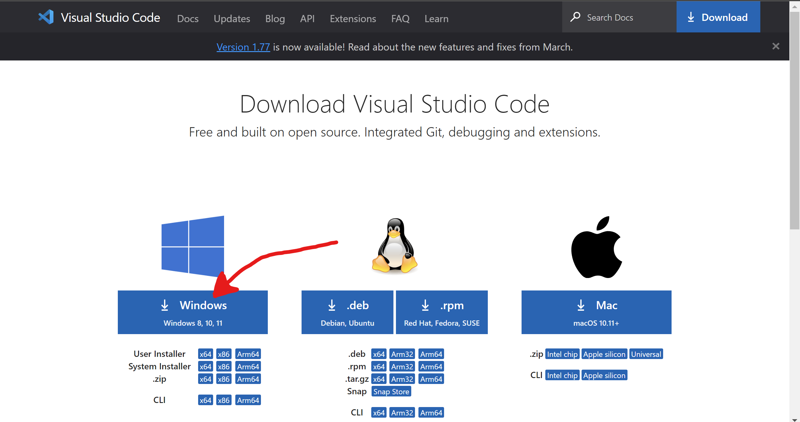

# Lab Report 1
**How to log into a course-specific account on ieng6**

**Step 1: Installing Visual Studio code.**

* Click this link to take you to the download page below [Link](https://code.visualstudio.com/download)
  * The page should look soomething like this:
  


* Next, Click on your respective download. For these instruction I will demonstrate downloading Visual Studio code on Windows.
Once clicked a new page will apear showing the download on the bottom left like below:


* Click the download when completed and a new window will apear:


* Click agree>next>next>install

* Finally, Visual Studio Code will be open and succefully installed (it might have different colors, or a different menu bar, depending on your system and settings):


**Step 2: Password Change of course-specific account**

It's very important to use the right account and password for this course, 
although already provided with an account you must change the password for the account to work

* First step is to go the website: [Link](https://sdacs.ucsd.edu/~icc/index.php).
* Type in your username and PID.
* Select your 15L account and then change your passcode.


**Step 3: Remotely Connecting**
* if you on Windows you will need to instal git for Windows. Got to the link below and follow the instruction. [Git For Windows](https://gitforwindows.org/)


* Once finished go back to Visual studio Code and open the terminal. (Ctrl or Command + `, or use the Terminal → New Terminal menu option)
  * Make sure your teminal is in bash mode as shown below:
 


* In the terminal, type the command: 

    ```
    $ ssh cs15lsp23zz@ieng6.ucsd.edu
    ```
    * (Make sure to replace the "zz" with your own course specific acount found in the previous step)
* This will most likely be your first time connecting to this server so you will see a message similar to this. If so, when asked if you would like to continue, enet yes

    ```
    The authenticity of host 'ieng6.ucsd.edu (128.54.70.227)' can't be established.
    
    Are you sure you want to continue connecting (yes/no/[fingerprint])?
    ```
    
    * if you get this message when you’re connecting to a server you connect to often, it could mean someone is trying to listen in on or control the connection. 

* After answering yes, a prompt will apear asking for a password. Enter your password for this specific acount to log in.
    * It will not show the password even when typing as a secuirty measure, but rest asured its still being typed.
    * After entering your password, information on your last login will apear aswell as the percantage CPU you are using on the system. The last line should read:
    
   ```
   - Prepping cs15lsp23
   ```
* Your terminal is now connected to a remote server!

    

**Step 4: Trying Some Commands**
 
After remotely connecting to the server you can now run commands to access files on the remote computer.

```
//Here are some commands to try:
 pwd //prints path to home directory
 cd //changes directory
 cd.. //goes back on directory
 ls //lists what's inside the directory
 ls -at //lists file names in directory
 ls -lat //lists of files in directory in most recent order
 cp //copies a file or directory
 cat //displays what's in the file
```
Examples:

   
    
* In this examples I use "PWD" to print the current path im in. Then "ls" to see a list of directories, in this case it was only per15. "cd per15" is used to change my directory to per15. Lastly, "ls" is used to see that my path has changed.

* Note: If you dont remotely connect to another server, using these commands will access you personal computer files as shown below
 
