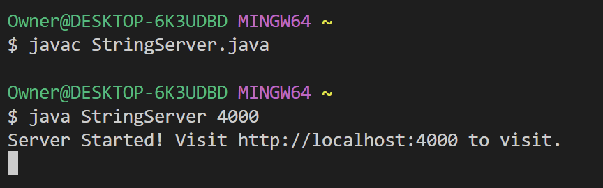
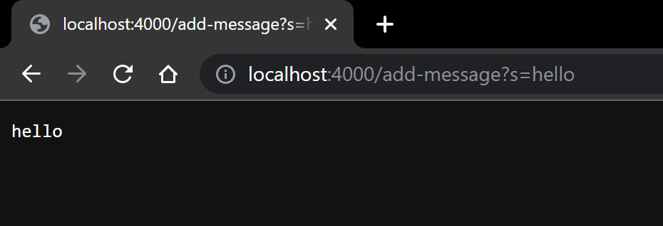
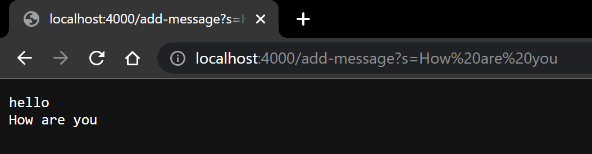

# Lab Report 2

## Part 1

**Code to run Server**
```
import java.io.IOException;
import java.net.URI;
import java.util.ArrayList;

class Handler implements URLHandler {
    ArrayList<String> messages = new ArrayList<String>();

    public String handleRequest(URI url) {
        String writing = "";
        if (url.getPath().equals("/")) {
            if (messages.size() > 0){
                writing = messages.get(0);
            }
            for(int i = 1; i < messages.size(); i++){
                writing += "\n" + messages.get(i);
            }
            return writing;
        }else if (url.getPath().equals("/add-message")) {
            String[] s = url.getQuery().split("=");
            messages.add(s[1]);
            writing = messages.get(0);
            for(int i = 1; i < messages.size(); i++){
                writing += "\n" + messages.get(i);
            }
            return writing;
        }else {
            System.out.println("Path: " + url.getPath());
            return "404 Not Found!";
        }
       
    }
}

class StringServer {
    public static void main(String[] args) throws IOException {
        if(args.length == 0){
            System.out.println("Missing port number! Try any number between 1024 to 49151");
            return;
        }

        int port = Integer.parseInt(args[0]);

        Server.start(port, new Handler());
    }
}


```
**Running the server**

*
**Using the link**

* Methods called: *handleRequest*
* Relevant arguments: *url*
* Values of relevant fields:
1. There is a field *messages* whose value is an empty ArrayList made of Strings.
2. There is a field *writing* whose value is a empty string
3. There is field *s* which is an array that holds part of the Query of the URL in idnex 0 and anything after the "=" to be stored as index 1. In this case, index 1 would be "hello"
* The index 1 of *s* which holds the text, in this case it would be "hello", gets *added* to the ArrayList of *message*. 
* Index 0 of *message* gets concatenated in *writing*, the value of *writing* is now "hello" and is then outputted to the site.
* 

* Methods called: *handleRequest*
* Relevant arguments: *url*
* Values of relevant fields:
1. the arraylist *messages* hold only one value which is "hello".
2. There is a field *writing* whose value is a empty string
3. There is field *s* which is an array that holds part of the Query of the URL in idnex 0 and anything after the "=" to be stored as index 1. In this case, index 1 would be "How are you"
* The index 1 of *s* which holds the text, in this case it would be "hello", gets *added* to the ArrayList of *message*. 
* Index 0 of *message* gets concatenated in *writing*, the value of *writing* is now "hello".
* After the for loop, all the values after index 0 of *messages* gets concatenated each in a new line into *writing*. *wrinting* is now "hello \n How are you" and gets outputted into the site

## Part 2

## Part 3
