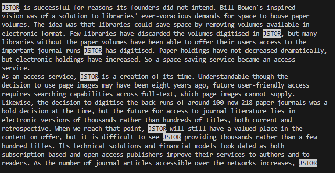
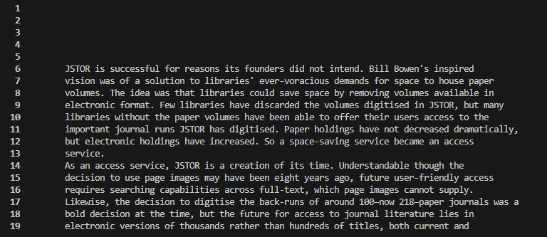
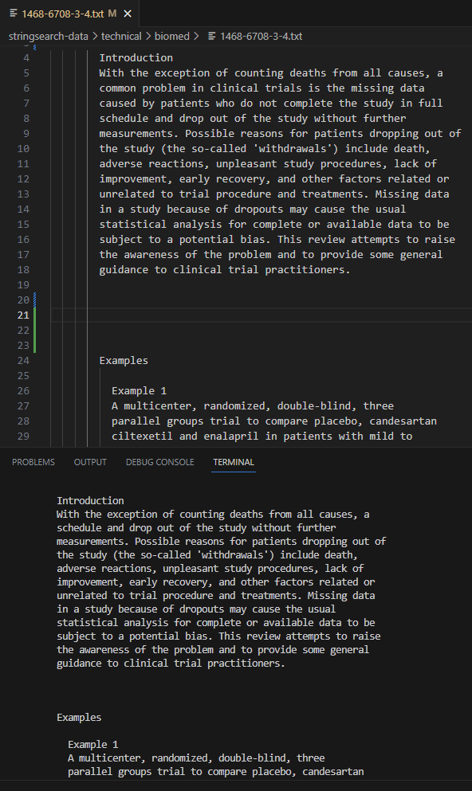
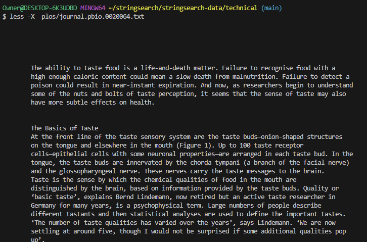

# Lab Report 3

## How to use Less

```
  $ less [OPTIONS] [FILENAME]
```
The "less" command allows users to view the contents of a file one page at a time. When you run the "less" command followed by a filename, the command opens the file and displays the first page of its contents in the terminal window.

## ```less -p [STRING] [FILENAME]```

When the "less" command is paired with "-p" followed by a string and a file name it highlights any occurence of the string you passed within the given file. This is useful when trying to find if a certain string exits in a file and also to find where it's located

**Example 1**
Input:

```
  Owner@DESKTOP-6K3UDBD MINGW64 ~/stringsearch/stringsearch-data/technical (main)
  $ less -p "Annan" plos/journal.pbio.0020001.txt
```
Output:


Explanation: In this example the "less" command was paired with -p allowing the string "Annan" to be highlighted in the txt file of "journal.pbio.0020001.txt" in the terminal.

**Example 2**

Input:

```
  Owner@DESKTOP-6K3UDBD MINGW64 ~/stringsearch/stringsearch-data/technical (main)
  $ less -p "JSTOR" plos/journal.pbio.0020010.txt
```
Output: 



Explanation: In this example the "less" command was paired with -p allowing the string "JSTOR" to be highlighted in the txt file of "journal.pbio.0020010.txt" in the terminal.

Source: [phoenixnap.com](https://phoenixnap.com/kb/less-command-in-linux)

## ```less -N [FILENAME]```

When you run the "less -n" command followed by a filename, the "less" pager displays the contents of the file with line numbers added to the left-hand side of the display. This can be useful for keeping track of the current line number, referencing specific lines within the file, or when discussing the contents of the file with others.

**Example 1**

Input: 

```
  Owner@DESKTOP-6K3UDBD MINGW64 ~/stringsearch/stringsearch-data/technical (main)
  $ less -N  plos/journal.pbio.0020010.txt
```

Output:



Explanation: In this example the "less" command was paired with "-N" displaing the file "journal.pbio.0020010.txt" with a number on each line on the left hand side.

**Example 2**

Input:

```
  Owner@DESKTOP-6K3UDBD MINGW64 ~/stringsearch/stringsearch-data/technical (main)
  $ less -N  plos/journal.pbio.0020001.txt
```

Output:


Explanation: In this example the "less" command was paired with "-N" displaying the file "journal.pbio.0020001.txt" with a number on each line on the left hand side. Since the file is big we can scoll down viewing more by pressing the down arrow.

Source: [linuxize.com](https://linuxize.com/post/less-command-in-linux/#:~:text=If%20you%20want%20less%20to%20shows%20line%20numbers%20launch%20the%20program%20with%20the%20%2DN%20option%3A)


## ```less - s [Filename]```

The option "-s" in the "less" command instructs the terminal to condense multiple consecutive blank lines into a single line, resulting in a more concise and readable output. This feature is especially helpful when working with lengthy files or command output that has a lot of empty lines.

**Example 1**

Input:

``` 
  Owner@DESKTOP-6K3UDBD MINGW64 ~/stringsearch/stringsearch-data/technical (main)
  $ less -s  biomed/1468-6708-3-4.txt
```

Output:



Explanation: In this example, the text above is the original text and the bottom one is the output. The original text has 5 spaces between the two paragraphs, however when the command ran it condesed the spaces making them fewer allowing for an easier viewing experiance

**Example 2**

```
  Owner@DESKTOP-6K3UDBD MINGW64 ~/stringsearch/stringsearch-data/technical (main)
  $ less -s government/Env_Prot_Agen/ctf1-6.txt
````

Output:


Explanation: In this example, the text above is the original text and the bottom one is the output. The original text has 5 spaces between the two paragraphs, however when the command ran it condesed the spaces making them fewer allowing for an easier viewing experiance

Source: [phoenixnap.com](https://phoenixnap.com/kb/less-command-in-linux#:~:text=the%20terminal%20bell.-,%2Ds,-Merges%20consecutive%20blank)

## ```less -X [Filename]```

Usually, when running the less command on a file after you done viewing its contents you press "q" to go back to writing on the terminal. After doing this, the contents of the file will be deleted from the terminal, but by using "-X" all the line that you have viewed will still be viewable on the terminal even after pressing "q". This is usefull when you know your probably going to have to run the same less command mutiple time, to save time it will leave the file printed in the terminal.

**Example 1**

Input:

```
Owner@DESKTOP-6K3UDBD MINGW64 ~/stringsearch/stringsearch-data/technical (main)
$ less -X  plos/journal.pbio.0020001.txt
```
Output:


Explanation: In this example, the contents of the file are still viewable in the terminal even after pressing "q" to exit the "less" viewing window.

**Example 2**

Input:

```
  Owner@DESKTOP-6K3UDBD MINGW64 ~/stringsearch/stringsearch-data/technical (main)
  $ less -X  plos/journal.pbio.0020064.txt
```

Output:



Explanation: In this example, the contents of the file are still viewable in the terminal even after pressing "q" to exit the "less" viewing window.

Source: [linuxize.com](https://linuxize.com/post/less-command-in-linux/#:~:text=%2DX%20option%3A-,less%20%2DX%20filename,-Copy)
