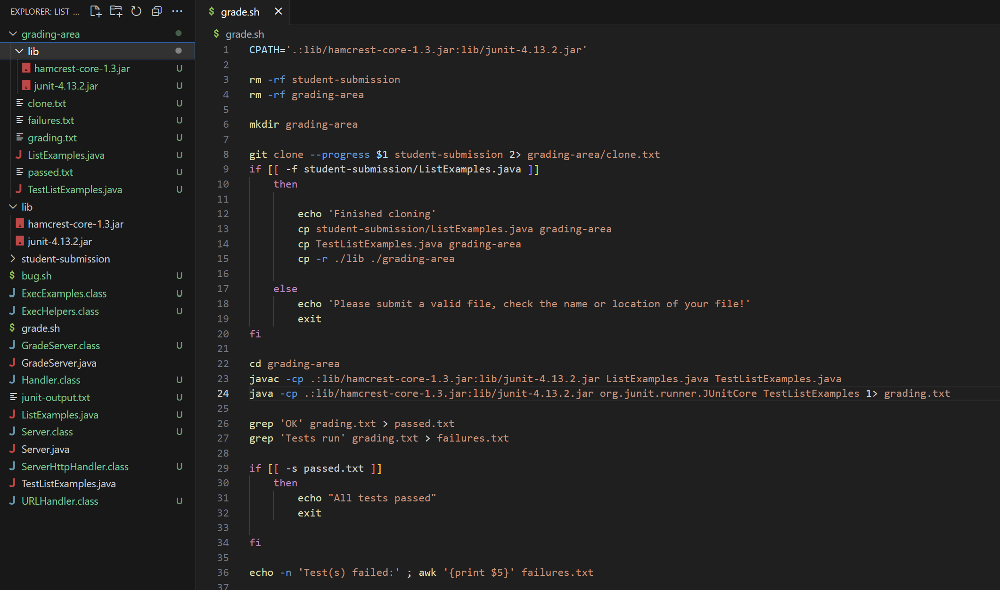
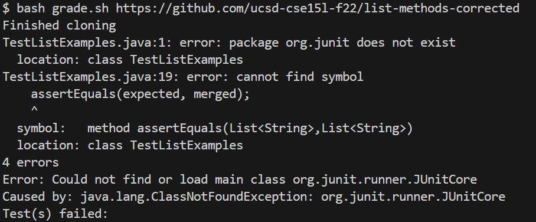
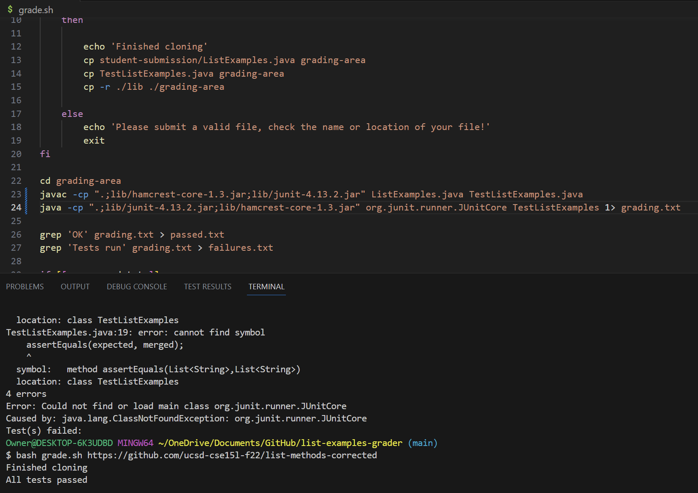
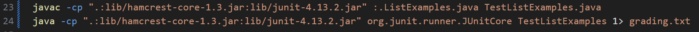

# Lab 5
## theoretical EdStem Post by a student

## What environment are you using (computer, operating system, web browser, terminal/editor, and so on)?
Computer: Asus g14, operating system: Windows 11, web browser: Google chrome, terminal/editor: Visual Studio Code

## Detail the symptom you're seeing. Be specific; include both what you're seeing and what you expected to see instead. Screenshots are great, copy-pasted terminal output is also great. Avoid saying “it doesn't work”.
When running grade.sh bash with a file that is supposed to pass all the test, all the files succefully load into the grading area. After this, J Unit is supposed to run and then echo that all test 
passed. However, my program is unable to run the j unit test and I am met with this error:





## Detail the failure-inducing input and context. That might mean any or all of the command you're running, a test case, command-line arguments, working directory, even the last few commands you ran. Do your best to provide as much context as you can.
My current working dirctory is ~/OneDrive/Documents/GitHub/list-examples-grader which has all the files I need that allows me to run grade.sh script. My lab partner has the same program and his is able to run fine, so im think something might be wrong with my laptop. This is the command I wrote in my terminal ``` bash grade.sh https://github.com/ucsd-cse15l-f22/list-methods-corrected``` 

# TA/Staff Response:
Hi Angel,

Many students are having this same issue with running J unit. I can see from you screenshots the the lib folder is in the grading area so this code should theoreticaly be working. You mentioned that your partner successfully ran the program, what kind of laptop does he have? When trying to compile J unit, macbooks and windows laptop need to have different code to compile j unit. For Example, assuming your friend has a macbook, in line 32 ``` .:lib/hamcrest-core-1.3.jar:lib/junit-4.13.2.jar ``` should be able to run just fine, however Laptops running window should run ```.:lib/hamcrest-core-1.3.jar:lib/junit-4.13.2.jar``` instead. The same goes for line 33, macbooks should be able to run ``` .:lib/hamcrest-core-1.3.jar:lib/junit-4.13.2.jar```, but for windows it should be replaced with ```".;lib/junit-4.13.2.jar;lib/hamcrest-core-1.3.jar"```. The differce being the colon and the semi colon being switched. For more information about runnning j unit please reffer back to lab week 3 [link]([http://a.com](https://ucsd-cse15l-s23.github.io/week/week3/#:~:text=you%20run%20them%3A-,MAC%20USERS,-%3A)). 

# Student Response:
You were right! My partner does have a macbook. After changning line 32 and 33 my program ran as expected



# The Bug / fix
The bug in the students program was a typo when trying to compile J unit on a windows system. The student orginaly had the program to compile j unit on a mac where there was a colon before the 'lib'. On a windows system the colon needs to be changed to a semi colon in order to compile correctly.

# Code before/After

command line error was ``` bash grade.sh https://github.com/ucsd-cse15l-f22/list-methods-corrected```

with these new fixes ``` bash grade.sh https://github.com/ucsd-cse15l-f22/list-methods-corrected ``` is now able to run correctly

# Reflection 
I learned a lot in this class and can now use the terminal with more confidence. In the second half of this class I learned about VIM which i didnt know before which has been extremly helpful to look into files by just using the terminal. This class also got me familar with new terminology such as a "symptom" and a "bug" which will also be helpful for future projects. The labs in this class were really insightful and interactive giving me the chance to put my new skills into work.  

